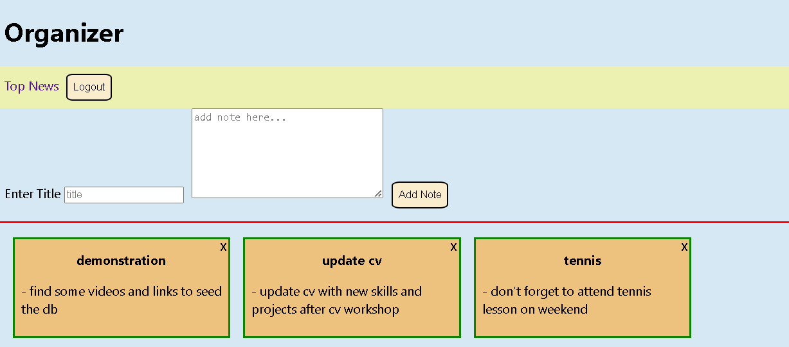
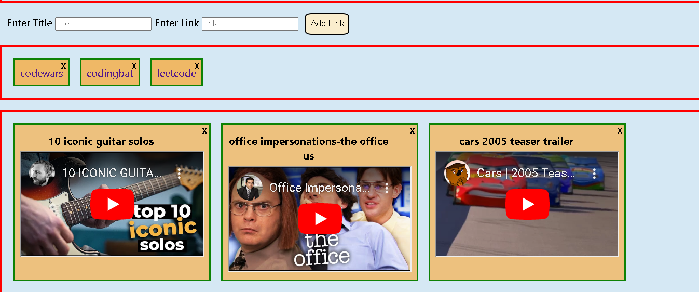
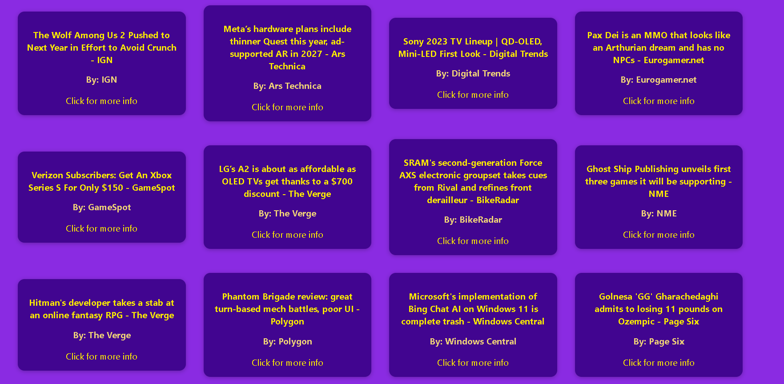

# Organizer

- Full Stack React app allowing organization of notes, links, YouTube videos.

- Shows the latest news from a random topic.

- Support multiple users with user authentication.

- Used JS, HTML, CSS, React on the frontend; MongoDB, express on the backend.
